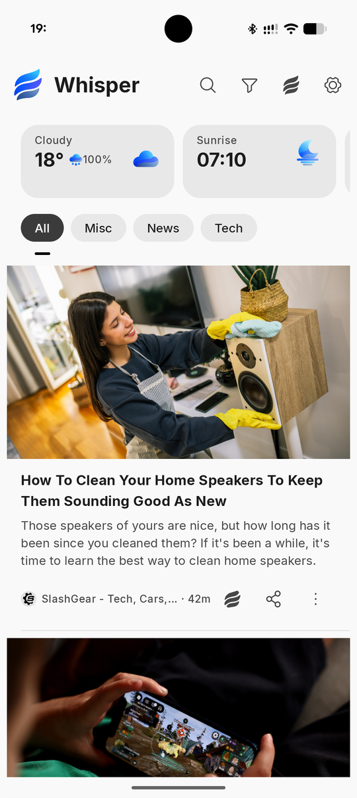
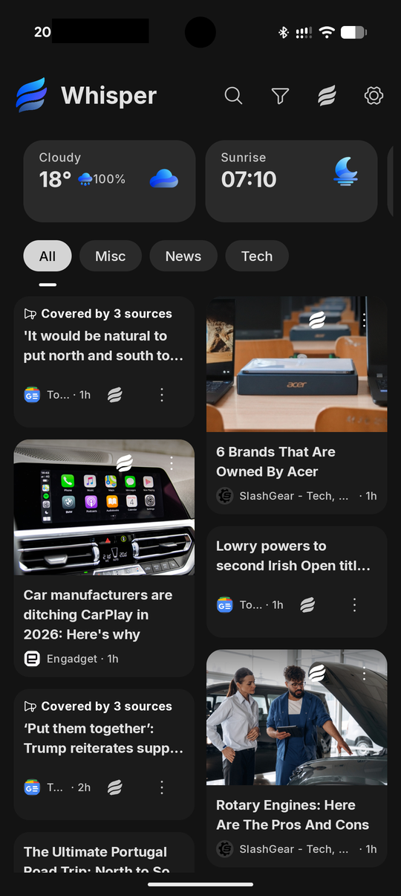
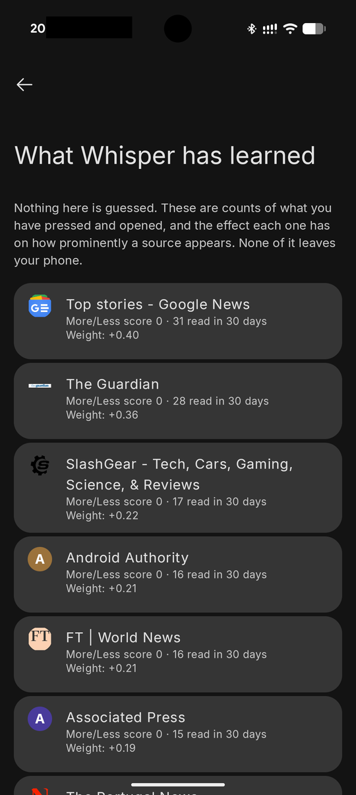
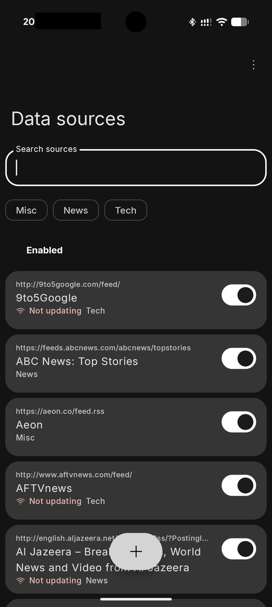

<div align="center">

<picture>
  <source media="(prefers-color-scheme: dark)" srcset="docs/brand/07_production/lockup_horizontal_notag_dark.png">
  
</picture>

**Curate. Read. Breathe.**

An RSS reader that tells you why it put an article where it did — and lets you
disagree.

[](LICENSE)


</div>

---

Whisper is a reader for the feeds you chose. It needs no account, keeps
everything on your phone, and works fully offline.

What makes it different from the other good readers is the ordering. Most are
chronological, which is honest but flat; the rest use an algorithm that will
not tell you what it is doing. Whisper's feed gives more room to some articles
than others — and every one of those decisions can be inspected per article,
disagreed with per source, and reset. Chronological order is still there, and
is still the default.

If you run **Lawnchair**, it can also live on your launcher's Discover page.
That is a bonus rather than the point — see
[On your launcher's home screen](#on-your-launchers-home-screen-optional).

## Status

**Version 1.0.0, feature complete, in private testing. Not yet released.**

The feature work is done and the app has been through a full security,
correctness and performance audit — see [`docs/AUDIT_2026-09.md`](docs/AUDIT_2026-09.md).
What is left before a public release is on-device verification, which is being
done now, and a signed build.

Two things are honestly incomplete and worth knowing:

- **Google Reader sync has been proven against FreshRSS only.** It runs two
  way against a live FreshRSS server, with 114 feeds, since September 2026.
  Miniflux and the other services speak the same protocol but have not been
  tried.
- **There are no instrumentation or screenshot tests.** 794 unit tests cover
  the logic; every on-device check so far has been done by hand.

[`ROADMAP.md`](ROADMAP.md) has the position section by section, including what
was deliberately left undone and why.

## Screenshots

<div align="center">

| The feed | Mosaic |
|---|---|
|  |  |

| What it has learned | Your sources |
|---|---|
|  |  |

</div>

The third image is the one to look at. Every source carries the number of
articles actually read from it, the effect that has on how prominently it
appears, and a way to undo any of it. Nothing there is inferred and none of it
leaves the phone.

*Still to come: the launcher panel.*

## Download

No public release yet. When there is one it will be on the
[Releases](https://github.com/defsix/whisper_feed/releases) page.

Until then, build it yourself — see [Building](#building). Test builds are
handed out privately and are signed with the repository's public test key, so
they are not upgradeable to a real release and are not for distribution.

## What it does

**Sources you control**
- Add a feed by address, or paste a *website* and Whisper finds the feed — it
  knows how to dig the feed address out of a YouTube channel page
- Import OPML, or point it at your **browser's bookmarks** and it works out
  which of those sites publish feeds, grouped by site, probed at the origin
- A starter list you can take or leave, and remove entirely
- Multi-select for bulk work: categories, enable, disable, delete, clear
  articles, and find feeds you have added twice under different names
- Broken feeds are surfaced rather than left looking quiet, and Whisper will
  go and look for the feed's new address

**Reading**
- Four layouts — Cards, Magazine, List, Mosaic
- Article size earned rather than positional: recency, your own reading habits
  and whether several sources are covering one story
- Mark read on scroll, with read articles dimmed or hidden as you prefer
- Bookmarks, pinning, and full article text fetched per-feed or globally
- A reader and an in-app browser, matched to each other

**Personalisation you can see** — the part nothing else does
- Tap through to **why** an article was given the size it was: recency, how
  often you read that source, whether several sources are covering one story
- More like this / less like this, and a screen showing exactly what the app
  has learned, per source, with a reset that actually resets
- Weekly on-device suggestions drawn from what you read — never a server,
  never someone else's recommendation
- Chronological order is always available, and is the default

**The glance row**
- Weather and sunrise/sunset, optional and off by default
- **No location permission.** You type a place name, and the coordinates are
  rounded to about a kilometre before a forecast is requested

**Sync and backup**
- Google Reader API sync, two way — FreshRSS, Miniflux, The Old Reader and
  others (see the caveat under Status). [Run your own FreshRSS](#sync-with-your-own-server-optional)
- OPML and settings backup to a folder you choose, on a schedule
- Android backup, off by default and asked separately for cloud and for
  phone-to-phone transfer

## On your launcher's home screen (optional)

Whisper can occupy **Lawnchair's left-most page** — the slot the Pixel Launcher
reserves for Google Discover.

```
Home screen → swipe right → Whisper
```

It is a genuine native launcher overlay, **not** a home-screen widget, and it
is the same app: the panel and the app window are deliberately identical, with
the same layouts, cards and gestures.

**You do not need this.** Most people installing a reader want a reader, and
Whisper is one whether or not a launcher ever asks it for a page. The setup
lives on its own screen in Settings and is written as an offer rather than a
step you have missed.

It works with Lawnchair and, very probably, its forks — they inherit the same
`FeedBridge`, though nobody has tested one. The Pixel Launcher cannot do this
and never will: it is hardwired to Google's own app, with no public API and no
setting. [`ROADMAP.md`](ROADMAP.md) has the launcher-by-launcher position under
*Replacing Discover: what is actually possible*.

See [Getting Lawnchair to use it](#getting-lawnchair-to-use-it) below for the
four-step setup.

## Sync with your own server (optional)

Whisper needs no account. To keep subscriptions and reading in step across
devices, run a small FreshRSS server and sign in to it under
**Settings → Account**.

```
Docker + an https address → FreshRSS → Whisper: Settings → Account
```

[`docs/SYNC_SERVER_FRESHRSS.md`](docs/SYNC_SERVER_FRESHRSS.md) is the whole
setup with Docker Compose. It includes the one setting that
stops sites turning your server away, and what to do if some feeds show as
**On this phone only**.

## Principles

- Material 3 throughout, with Material You dynamic colour and light/dark/system
- **Local-first.** Room is the source of truth, it works fully offline, and it
  needs no account
- **You own your sources.** Add, remove, edit, categorise, mute, import, export
- **Transparent personalisation**, inspectable and resettable, never a
  mandatory opaque algorithm
- OPML-compatible, never Feedly-dependent
- **No adverts, no sponsored stories, no analytics, no telemetry.** Not as a
  default — there is no such code in the app at all

## Explicit non-goals

Whisper does not ingest, scrape or synchronise your actual Google Discover
stream. There is no supported public API for it, and the alternatives —
scraping the Google app, accessibility hacks, reverse-engineering private
endpoints — are brittle and inappropriate. The goal is to reproduce the
*quality of the experience* with sources you control.

## Building

Requires JDK 21 and an Android SDK with platform 37 and build-tools 36.

```bash
echo "sdk.dir=/path/to/android-sdk" > local.properties
./gradlew assembleDebug
```

Three build types:

| Build | What it is |
|---|---|
| `assembleDebug` | Unminified, `io.zero76.whisper.dev`. Fast to build, and the one to debug with. |
| `assemblePreview` | **Release, made installable.** Fully minified and shrunk, signed with the repository's test key, and carrying the same `.dev` id as debug so it installs over one. What testers get. |
| `assembleRelease` | Minified and **unsigned**, on purpose. Signing is a local step with a key that never comes near this repository. |

The APK lands in `app/build/outputs/apk/<type>/`.

`app/debug.keystore` is committed deliberately. It is the standard Android
debug key — `android` / `androiddebugkey`, the same credentials every SDK
install ships — so it grants nobody anything, and having it in the repository
is what makes a build here and a build on your machine interchangeable. It must
never sign a release.

### Getting Lawnchair to use it

Lawnchair only accepts feed providers on a hardcoded package whitelist, and
`io.zero76.whisper` is not on it yet. For a local build, unlock Lawnchair's
debug menu and turn the check off:

1. Open the App Drawer, tap the search field, type `/lawnchairdebug`
2. Open Lawnchair Settings — a build icon appears in the overflow — and go to
   **Debug menu**
3. Enable **Ignore feed whitelist**
4. In **Home screen settings → Feed provider**, select **Whisper**

No root, LSPosed or Shizuku required. The mechanism is documented in
[`UPSTREAM_NOTES.md`](UPSTREAM_NOTES.md) §3, and the whitelist request is
drafted in [`docs/LAWNCHAIR_WHITELIST.md`](docs/LAWNCHAIR_WHITELIST.md).

### Granting "Display over other apps"

Needed to open articles you tap from the launcher panel — the feed renders
without it, but taps do nothing. Whisper does not use it to draw anything;
holding it is what exempts the app from Android's background-activity-launch
restriction.

Whisper explains this on **Settings → Launcher** rather than demanding it on
launch. On a sideloaded build the toggle may be greyed out, because Android
restricts sensitive permissions for apps not installed from a store — unblock
it via **Settings → Apps → Whisper → ⋮ → Allow restricted settings**, then
grant it.

## Documentation

| | |
|---|---|
| [`ROADMAP.md`](ROADMAP.md) | Where every section stands, and what was left undone on purpose |
| [`docs/AUDIT_2026-09.md`](docs/AUDIT_2026-09.md) | The security, correctness and performance audit |
| [`UPSTREAM_NOTES.md`](UPSTREAM_NOTES.md) | How the launcher integration actually works |
| [`CHANGELOG.md`](CHANGELOG.md) | Release history |
| [`ATTRIBUTION.md`](ATTRIBUTION.md) | Upstream copyright and credits |
| [`docs/SYNC_SERVER_FRESHRSS.md`](docs/SYNC_SERVER_FRESHRSS.md) | Running your own FreshRSS server to sync with |
| [`docs/FRESHRSS_TEST_SERVER.md`](docs/FRESHRSS_TEST_SERVER.md) | Standing up a server to test sync against |

## Privacy and terms

Whisper is published by **[Nyancat Labs](https://nyancatlabs.com)**, a company
registered in Ireland, which is the data controller — and holds none of your
data, because there is no server for it to arrive at.

- **[Privacy](PRIVACY.md)** — the complete list of what leaves your phone.
  Short version: no servers, no analytics, no accounts, and no location
  permission.
- **[Disclaimer](DISCLAIMER.md)** — Whisper is a reader, not a publisher. You
  choose the sources; nothing is hosted or redistributed here.

Anything at all: [hej@nyancatlabs.com](mailto:hej@nyancatlabs.com).

## Brand

Assets and the palette are in [`docs/brand/`](docs/brand/). The production
artwork the app ships is in
[`docs/brand/07_production/`](docs/brand/07_production/); the other directories
are concept-board crops kept for reference and show an earlier symbol.

## Licence and attribution

**GPL-3.0-or-later** — see [`LICENSE`](LICENSE). Published by
[Nyancat Labs](https://nyancatlabs.com); the licence is what governs your use
of it, and it is the same licence whoever publishes it.

Whisper is a fork of [Neo Feed](https://github.com/NeoApplications/Neo-Feed),
which is itself a fork of
[HomeFeeder](https://github.com/iTaysonLab/HomeFeeder), whose launcher-overlay
implementation it retains. See [`ATTRIBUTION.md`](ATTRIBUTION.md) for full
credits.

## Support

Whisper is free, carries no adverts and collects nothing, and that is not going
to change. If it has earned it, there is [Ko-fi](https://ko-fi.com/defsix) —
nothing in the app is withheld from anyone who ignores it.
